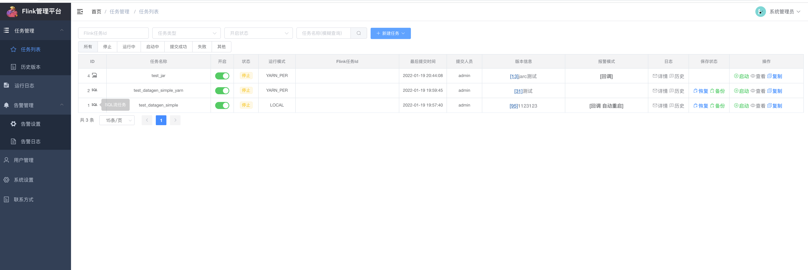
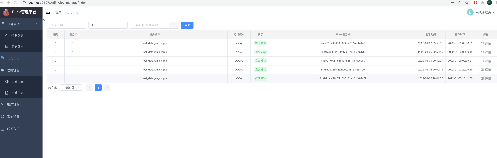
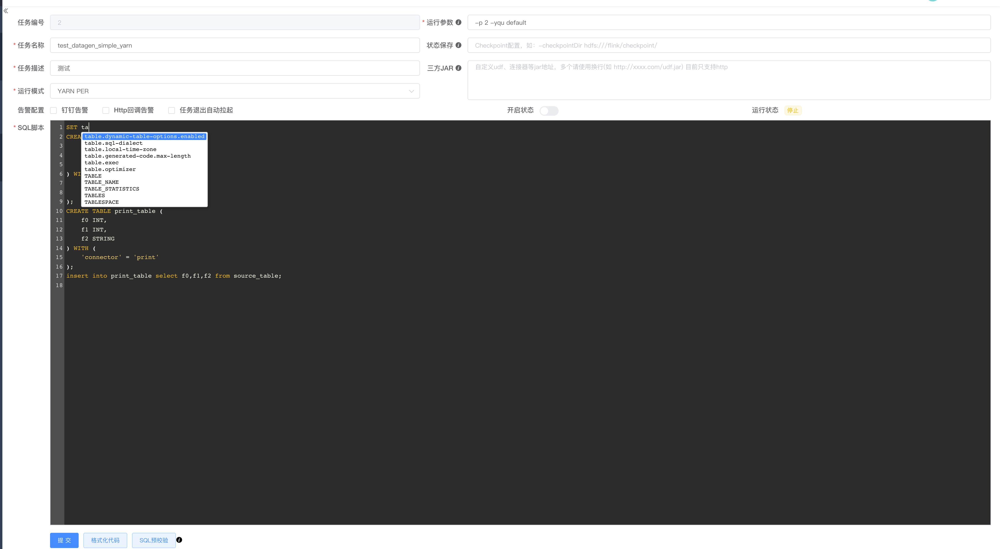
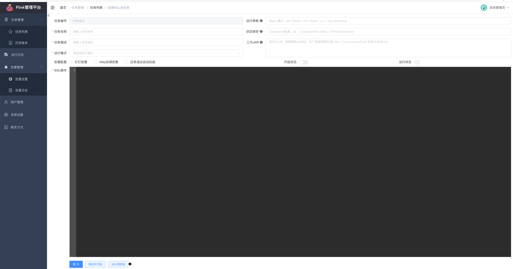
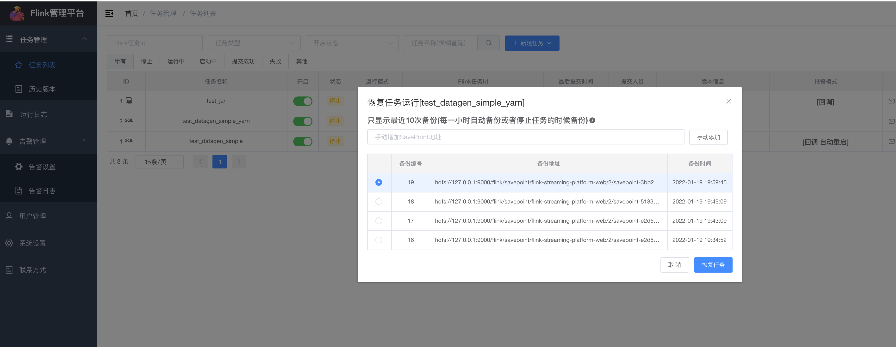
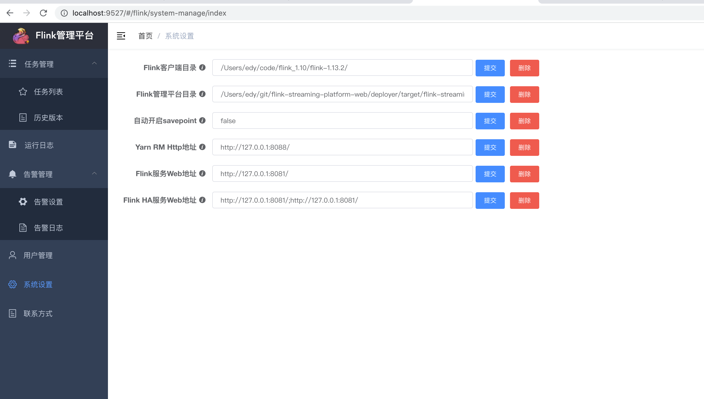
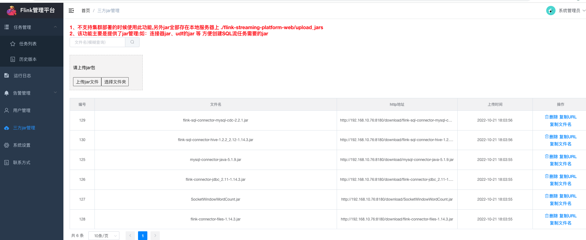

~~~~ 
打不开图片可以绑定一下hosts 试试
# GitHub Start
151.101.184.133     assets-cdn.github.com
151.101.184.133     raw.githubusercontent.com
151.101.184.133     gist.githubusercontent.com
151.101.184.133     cloud.githubusercontent.com
151.101.184.133     camo.githubusercontent.com
151.101.184.133     avatars.githubusercontent.com
151.101.184.133     avatars0.githubusercontent.com
151.101.184.133     avatars1.githubusercontent.com
151.101.184.133     avatars2.githubusercontent.com
151.101.184.133     avatars3.githubusercontent.com
151.101.184.133     avatars4.githubusercontent.com
151.101.184.133     avatars5.githubusercontent.com
151.101.184.133     avatars6.githubusercontent.com
151.101.184.133     avatars7.githubusercontent.com
151.101.184.133     avatars8.githubusercontent.com
151.101.184.133     avatars9.githubusercontent.com
151.101.184.133     avatars10.githubusercontent.com       
~~~~

 
 
 
 
 
 
 
